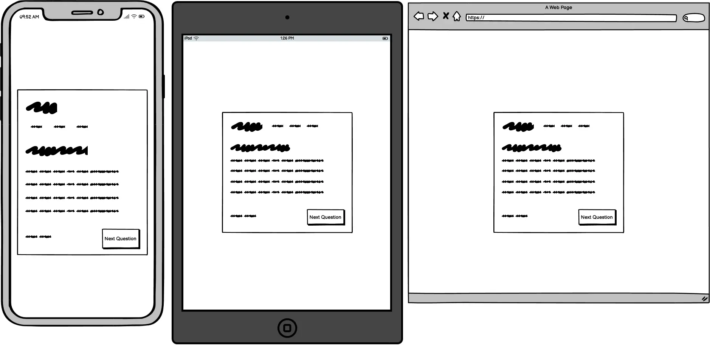

# Introduction
Kartilo is an interactive web application for learning JavaScript using quiz/flash cards. The name comes from the [Esperanto](https://en.wikipedia.org/wiki/Esperanto) word 'karto', which means 'card', and the suffix '-ilo', which indicates a tool or instrument.

## User Experience (UX)
### Project Goals

>'Why are we making this product?'

>'What is worth doing?'

Making handwritten or digital flash cards is time consuming and hard work. The aim of Kartilo is to take the pain out of preparing questions by providing a moderately sized dataset of JavaScript questions so you can start testing yourself immediately.

>'What are we creating?'

An interactive quiz using html, css, and JavaScript.

>'What value does it provide?'

It has been suggested that making notes and [other passive methods](https://www.bbc.co.uk/news/health-22565912) of studying do not help you learn. It is more effective to engage in [active learning](https://www.cambridge.org/us/education/blog/2019/06/25/what-active-learning-and-what-are-benefits/), which engages the brain. Therefore, Kartilo is convenient way to test yourself on JavaScript rather than make hand made flash cards or questions.

### Target Audience
Students or anyone interested in learning/being quizzed on JavaScript.

### User Needs / Stories

#### First Time Visitor Goals
1. I want to be able to select a quiz category.
2. I want a set list of questions I do not have to create myself.
3. I want to be able to upload my own questions.
4. I want to be able to see my final score.
5. I want to see the correct answer after I have answered a question.
6. As a user with dyslexia I want font and colour options that are easy to read.
7. I want to pause and resume a quiz so I can take breaks.
8. As a visually impaired user I want the app to be compatible with screen readers.
9. I want explanations for the answers.
10. I want to adjust a time limit for questions so I can challenge myself based on my preference.
11. I want to be able to tell you about any bugs I encounter.
12. I want to be able to choose the number of questions I answer.

#### Returning & Frequent Visitor Goals
13. I want to track my progress over time so I can see how I'm improving.
14. I want to earn badges or points for achieving milestones.
15. I want to see a leader board.

### Strategic Trade-offs
I have assigned a score out of five (5) to the importance and viabilty / feasibility for each of the user goals to establish the immediate focus. Anything fallout outside of the immediate focus will be considered for a future implementation.

---
|Opportunity / Problem|Importance|Viability / Feasibility|Result|Possible Solution|
|-|-|-|-|-|
|1. I want to be able to select a quiz category.|1|5|Will not be addressed: App focuses on JS only.|Possible future implementation.|
|2. I want a set list of questions I do not have to create myself.|5|5|Will be addressed.|Include a sample of JS questions.|
|3. I want to be able to upload my own questions.|1|5|Will not be addressed.|Possible future implementation.|
|4. I want to be able to see my final score.|5|5|Will be addressed.|Final score modal.|
|5. I want to see the correct answer after I have answered a question.|5|5|Will be addressed.|Correct answer shown once answer is chosen.|
|6. As a user with dyslexia I want font and colour options that are easy to read.|5|5|Will de addressed.|Select the correct colours, contrast, and font consideration.|
|7. I want to pause and resume a quiz so I can take breaks.|1|1|Will not be addressed.|Only necessary if a timer is implemented. At present the user can leave the window open and come back to the quiz.|
|8. As a visually impaired user I want the app to be compatible with screen readers.|5|5|Will be addressed.|Use semantic html and appropriate labelling.|
|9. I want explanations for the answers.|5|5|Will be addressed.|Explanation once answer is chosen.|
|10. I want to adjust a time limit for questions so I can challenge myself based on my preference.|1|2.5|Will not be addressed.|Possible future implementation.|
|11. I want to be able to tell you about any bugs I encounter.|5|5|Will be addressed.|Contact email at the beginning/end of the quiz.|
|12. I want to be able to choose the number of questions I answer.|5|5|Will be addressed.|Input field during the rules section before the quiz begins.|
|13. I want to track my progress over time so I can see how I'm improving.|5|1|Will not be addressed.|The site will not store the result permanently but the user can see their end score and the current question number out of their total number of selected questions.|
|14. I want to earn badges or points for achieving milestones.|1|1|Will not be addressed.|Possible future implementation.|
|15. I want to see a leader board.|1|1|Will not be addressed.|Possible future implementation.|

## Features
> 'What are we going to make?'

We are looking to make a single page web application that will utilise html elements as modals/windows that will direct the user through the flow of the game.

It will consist of four parts:
1. Start.
2. Rules.
3. The Quiz.
4. The End/Final Score.

### Start
#### Opportunity/Problem addressed:
6. As a user with dyslexia I want font and colour options that are easy to read.
8. As a visually impaired user I want the app to be compatible with screen readers.
11. I want to be able to tell you about any bugs I encounter.

The start modal will act as a landing page. It will be the starting point for the application and set the scene and design for the quiz, which will initialise once the 'start' button has been pressed.

### Rules
#### Opportunity/Problem addressed:
12. I want to be able to choose the number of questions I answer.

The rules modal will contain the small number of rules for the game and include any relevant input fields. At present this will include the number of questions the user would like to attempt to answer. It will contain an 'exit' button, and a 'continue' button that will only be enabled once the input fields have a valid value.

### The Quiz
#### Opportunity/Problem addressed: 
5. I want to see the correct answer after I have answered a question.
9. I want explanations for the answers.

This is the main part of the web application and will display all the relevant information needed for the quiz:
- The score counter.
- The question.
- The possible answers.
- The question counter.
- The 'next' button to proceed to the next question once an answer has been selected.

### The End/Final Score
#### Opportunity/Problem addressed: 
4. I want to be able to see my final score.
11. I want to be able to tell you about any bugs I encounter.

This the final modal that will thank the user for playing the game and display their final score. It will present the option to quit, which will take them back to the start section, or replay the game, which will take them to the rules section.

### Future implementations

|Opportunity/Problem|Possible future implementation|
|-|-|
|Select quiz categories.|An additional dataset could be located and retrieved depending on the users input.|
|Upload own questions.|An additional field could be created to upload csv files in a specific format.|
|Time limit inc. pause/resume.|An additional field could be introduced that affects the disabled attribute for the answer buttons.|
|Earn badges.|To gamify the application could lead to a funner user experience and a higher number of return visitors.|
|Leader board.|To facilitate competition, status, and community.|

### Success Metrics
The following metrics can be measured to track the website's success:
- Google Analytics.
- Search engine listings.

### Accessibility
- Use semantic HTML.
- Ensure sufficient colour contrast.
- Provide information for screen readers where appropriate (e.g. aria-labels).

## Design Choices

### Sitemap

### Wireframes
#### Start Modal

#### Rules Modal

#### Quiz Modal

#### Final Modal

### Colours
The website uses a range of [soft pastel green colours](https://mycolor.space/?hex=%23A9D6BB&sub=1), which are easy on the eyes.

#### Pros:
- Soft pastel greens are associated with calm waters and tranquility. A great colour to help relax the mind before engaging in a test.
- Have positive associations: nature, freshness, and health.
- Gender neutral.

#### Cons:
- Potential contrast/visibility issues and a 'washed-out' look.

### Typography / Fonts
- Primary Font: [Roboto Flex Variable](https://fonts.google.com/specimen/Roboto+Flex) Font.
  - Modern and versatile.
  - Clean and legible.
  - Neutral and easy on the eyes.
- Headings & Titles: Roboto Flex 700
- Subheadings & Info: Roboto Flex 600.
- Body & Questions: Roboto Flex 400.

I have chosen Roboto Flex as the main font and will adjust its properties to change its appearance for headers, subheadings, and body text. Since it is a variable font I can use a single file, instead of two, and customise it to appear differently for sufficient contrast.

The font will have a display value of 'swap', which means the browser will swap the fallback font with the custom font once loaded.

Since I want the app to cater to as many people as possible I have chosen a font that is considered more 'clean cut' and 'readable' than stylistic choices so it will be more legible for those who have dyslexia.
The disadvantage of this may be that it won't look as unique to some people. However, when it comes to learning legibility, simplicity, and understanding are more important.

I will use the .woff2 font format since it has been specifically designed for the web, offers better compression, and performance.

### Icons
I will use the free icons supplied by [fontawesome](https://fontawesome.com/) and change their appearnace with css.

### Styling
The overall styling is attempting to convey a 'clean' feel with cool greens, soft box shadows, and rounded edges.

Correct answers will be associated with the green palette since general colour psychology depicts green as growth, safety, and a readiness to proceed/progress (green traffic lights).

Incorrect answers will use a red palette because it is associated with warnings, stopping, and indicating that something requires our attention.

## Technologies
- [HTML](https://html.spec.whatwg.org/multipage/)
- [CSS](https://www.w3.org/Style/CSS/)
- [JavaScript](https://tc39.es/)
- [Jest](https://jestjs.io/)
- [Node](https://nodejs.org/en)
  - [Babel](https://babeljs.io/docs/)

## Other Resources
- [VSCode](https://code.visualstudio.com/): Coding text editor.
- [Git](https://git-scm.com/): For version control and pushing to Github.
- [GitHub](https://github.com/): To store projects in a public repository.
- [GitHub Desktop](https://desktop.github.com/): Desktop software to simplify the Git/Github development workflow.
- [Google Fonts](https://fonts.google.com/): Fonts.
- [Google Variable Fonts](https://fonts.google.com/variablefonts): Variable Fonts.
- [Google Fonts Knowledge](https://fonts.google.com/knowledge/): Typography Knowledge. 
- [WebP Converter](https://developers.google.com/speed/webp): Converting images to the WebP format.
- [JEST](https://jestjs.io/): JavaScript testing.
- [jshint](https://jshint.com): JavaScript testing.
- [Font Awesome](https://fontawesome.com/): Icons.
- [mycolor.space](https://mycolor.space/?hex=%23A9D6BB&sub=1): For colours.

## Testing
Please visit the [testing](./testing.md) file.

## Deployment & Local Development
VSCode and Github Desktop were used for local development and pushing code to GitHub.

### Github Pages
1. Sign up and log into GitHub.
2. Select the project repository.
3. Click the settings link.
4. Within the left panel, under 'Code and automation', click 'Pages'.
5. Within the main window, under 'Build and deployment', select deploy from a branch.
6. Within the main window, under 'Branch', use the main branch and use the /root folder.
7. Save settings.

### Steps for Forking the Github Repository
1. Log into GitHub.
2. Go to the [Kartilo](https://github.com/cjns/Kartilo/) repository.
3. Select the 'Fork' button in the top right corner under your profile icon.

### Steps for Making a Local Clone
1. Log into GitHub.
2. Navigate to the repository you want to clone.
3. Select the '<> Code' and copy the link for your preferred method of cloning the site.
4. Use your terminal to navigate to the working directory you want use.
5. Type `git clone` into the terminal and paste the link you copied in step 3 and press enter.

## Credits
[Coding Nepal](https://www.youtube.com/watch?v=WUBhpSRS_fk) for influencing the feel of the quiz app.

## Code
[Fisher-Yates (Knuff) shuffle](https://stackoverflow.com/questions/2450954/how-to-randomize-shuffle-a-javascript-array): Used in ui.js.

## Acknowledgements
- Code Institute Mentor, Graeme Taylor.
- Newcastle College University Centre Course Facilitator, Callum Jones.